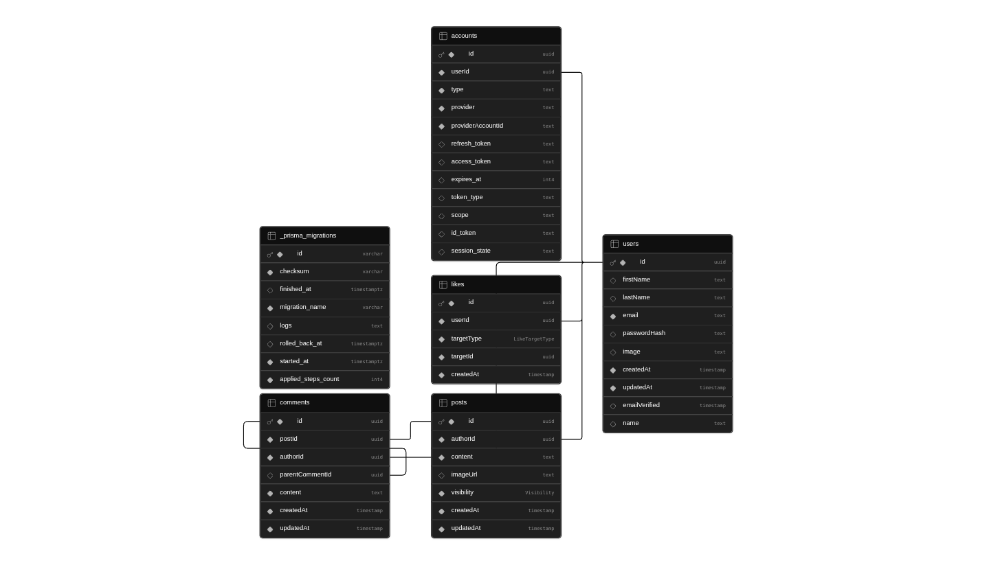

# Social Feed - Next.js

Professional social feed demo: registration, session auth, global timeline with text/image posts, visibility (public/private), nested comments/replies, and likes on posts and comments 

**Live app:** [https://buddy-script-bay.vercel.app](https://buddy-script-bay.vercel.app)

---

## Project overview

Users sign up with **first name, last name, email, and password**, sign in, and land on a **protected feed**. The feed shows **all public posts from everyone**, each user’s **own private posts**, **newest first**, with **likes** (with liker lists), **comments and replies** (each likeable), and **optional post images** via Cloudinary direct upload. The main timeline uses **infinite scrolling**: more posts load automatically as you reach the bottom, backed by **cursor-based** pagination on the API.

---

## Tech stack

| Layer           | Choice                                                                                                       |
| --------------- | ------------------------------------------------------------------------------------------------------------ |
| App framework   | **Next.js 16** (App Router), **React 19**                                                                    |
| Language        | **TypeScript**                                                                                               |
| Auth            | **Auth.js v5** (NextAuth): **JWT sessions**, **Credentials** + optional **Google OAuth**, **Prisma adapter** |
| Database        | **PostgreSQL**                                                                                               |
| ORM             | **Prisma 7** (`pg` driver adapter)                                                                           |
| Validation      | **Zod**                                                                                                      |
| UI              | **Ant Design 6**, **Tailwind 4** (layout/globals)                                                            |
| Client data     | **TanStack Query**                                                                                           |
| Images          | **Cloudinary** (signed direct upload; URLs validated on create)                                              |
| Package manager | **pnpm** (Node **≥ 24**)                                                                                     |

---

## Architecture decisions

- **Server-first**: Route handlers and server actions for sensitive work; client components only where needed (forms, timeline interactions).
- **Layered API**: `app/api/v1/*` handlers → Zod validation → **repositories** (`src/lib/repositories/*`) → Prisma. Keeps handlers thin and queries testable.
- **Auth boundary**: **Proxy** (`src/proxy.ts`, Next.js 16 convention) redirects unauthenticated users away from non-auth pages; `/api/auth/*` is excluded. **Defense in depth**: `withAuth` on feed APIs always checks the session and returns **401** if missing.
- **Polymorphic likes**: Single `Like` model with `(targetType, targetId)` and a **unique** constraint per user/target; indexes support counts and “recent likers” at scale.
- **Post visibility**: `PUBLIC` vs `PRIVATE`; feed query unions “all public” with “my private” so authors see their drafts-like content without exposing others’ private posts.
- **Images**: API returns a **short-lived signature**; the browser uploads to Cloudinary. Creating a post accepts only URLs that match the configured **cloud name** (no arbitrary remote images).
- **Infinite scrolling**: The feed uses **TanStack Query** `useInfiniteQuery` plus an **IntersectionObserver** on a bottom sentinel. Each page calls `GET /api/v1/posts` with the **next cursor** (not `OFFSET`), so large datasets stay efficient.

---

## Setup (local)

```bash
pnpm install
cp .env.example .env.local
# Fill DATABASE_URL, AUTH_SECRET, optional Cloudinary + Google — see below.
pnpm db:migrate
pnpm db:seed   # optional dev users
pnpm dev
```

Open `http://localhost:3000`. The app expects `.env.local` (and uses `prisma.config.ts` for migrations — see Database setup).

---

## Environment variables

Documented in [`.env.example`](.env.example). Summary:

| Variable                                | Scope  | Purpose                                                                           |
| --------------------------------------- | ------ | --------------------------------------------------------------------------------- |
| `NEXT_PUBLIC_SITE_URL`                  | Public | Canonical site origin (metadata, client-safe).                                    |
| `DATABASE_URL`                          | Server | App DB URL (pooled in production if your host recommends it).                     |
| `DIRECT_URL`                            | Server | **Migrations** / direct Postgres (e.g. non-pooled); falls back to `DATABASE_URL`. |
| `AUTH_SECRET`                           | Server | JWT/crypto secret (`openssl rand -base64 32`).                                    |
| `AUTH_URL`                              | Server | Public app URL in production (Auth.js behind proxies).                            |
| `AUTH_GOOGLE_ID` / `AUTH_GOOGLE_SECRET` | Server | Optional Google sign-in.                                                          |
| `CLOUDINARY_*`                          | Server | `CLOUD_NAME`, `API_KEY`, `API_SECRET`; optional `CLOUDINARY_UPLOAD_FOLDER`.       |

Never prefix secrets with `NEXT_PUBLIC_`.

---

## Database setup

ER diagram (Prisma / PostgreSQL):



_Core entities_: **`users`** (profile + optional `passwordHash`), **`accounts`** (OAuth linkage for Auth.js), **`posts`** (content, optional `imageUrl`, `visibility`), **`comments`** (threaded via `parentCommentId`), **`likes`** (polymorphic `targetType` + `targetId` for posts and comments). `createdAt` ordering plus composite indexes support newest-first feeds and cursor pagination for infinite scroll.

1. Create a PostgreSQL database and set `DATABASE_URL` (and `DIRECT_URL` when using a pooler for runtime).
2. **Prisma 7**: URLs are read from env via [`prisma.config.ts`](prisma.config.ts) (not embedded in `schema.prisma`).
3. Run migrations: `pnpm db:migrate` (dev) or `prisma migrate deploy` (CI/production — see [`vercel.json`](vercel.json) and [DEPLOYMENT.md](DEPLOYMENT.md)).
4. Optional: `pnpm db:seed` for sample accounts.
5. Indexes on `Post`, `Comment`, and `Like` support high read volume (visibility + time ordering, comment trees, like lookups).

---

## Authentication flow

1. **Register**: Server action hashes password with **bcrypt**, creates `User` + credential-backed identity (Prisma); then **signIn("credentials")**.
2. **Login**: Credentials validated in Auth.js `authorize` (bcrypt compare); session issued as **JWT** with user id and profile fields in callbacks.
3. **OAuth (optional)**: Google provider; adapter persists `Account` rows.
4. **Proxy**: Unauthenticated requests to pages outside `/login`, `/register`, and `/api/auth` redirect to `/login`. Logged-in users hitting auth pages redirect to `/`.
5. **APIs**: Every `/api/v1/...` feed route uses `withAuth` — no session → **401**.

---

## API overview (`/api/v1`)

All JSON APIs require a session cookie unless noted.

| Method & path                                      | Role                                                                       |
| -------------------------------------------------- | -------------------------------------------------------------------------- |
| `POST /posts`                                      | Create post (`content`, optional `imageUrl`, `visibility`).                |
| `GET /posts?cursor=&limit=`                        | Paginated feed (public + own private); **cursor** drives infinite scroll in the UI. |
| `POST/DELETE /posts/[postId]/likes`                | Toggle post like.                                                          |
| `GET /comments?postId=&cursor=&limit=`             | Top-level comments for a post.                                             |
| `POST /comments`                                   | Create comment or reply (`postId`, `content`, optional `parentCommentId`). |
| `GET /comments/[commentId]/replies?cursor=&limit=` | Paginated replies.                                                         |
| `POST/DELETE /comments/[commentId]/likes`          | Toggle comment/reply like.                                                 |
| `POST /uploads/cloudinary`                         | Signed upload params for direct client upload.                             |

Auth.js: `GET/POST /api/auth/*` (not under `v1`).

Responses use small helpers in `src/lib/api/response.ts`; validation errors return **400**; missing post/comment access returns **404**/denied as implemented in `resource-access-response`.

---

## Folder structure (high level)

```
src/
  app/                    # App Router: layouts, pages, route handlers, server actions
    (auth)/               # Login & register route group
    (feed)/               # Feed UI route group
    api/                  # REST handlers (v1 + Auth.js)
  auth.ts                 # Auth.js configuration
  proxy.ts                # Edge proxy: auth redirects (Next.js 16)
  components/             # UI (auth/, feed/, forms/, providers/, ui/)
  hooks/                  # React Query hooks for feed operations
  lib/
    api/                  # withAuth, JSON validation, pagination helpers
    repositories/         # Prisma query modules per aggregate
    schemas/              # Zod schemas (auth + feed)
    uploads/              # Cloudinary signing & URL trust checks
prisma/
  schema.prisma           # Models & indexes
  migrations/             # SQL migrations
```

---

## Scalability considerations

- **DB indexes** aligned to feed sort, per-post comments, reply threads, and like aggregations.
- **Cursor-based pagination** on posts, comments, and replies (including the **infinite-scrolling** feed UI) to avoid large `OFFSET` scans.
- **JWT sessions** reduce per-request DB session table lookups (adapter still used for OAuth/account linking).
- **Direct uploads** to Cloudinary keep binaries off the app server.
- Further growth: read replicas for feed queries, cache hot post metadata, eventual CQRS or materialized “feed shard” tables if write rates dominate.

---

## Security decisions

- Passwords: **bcrypt** only; no plaintext storage.
- **HTTP-only** session cookie (Auth.js defaults); **HTTPS** assumed in production.
- **Input validation** with Zod on all write bodies and list queries.
- **Post images**: server-issued signatures; **URL allowlist** to configured Cloudinary host.
- API errors: generic **500** messages without leaking stacks to clients (`withAuth` catches and logs).
- **Authorization**: private posts enforced in repository/read-access helpers, not only in the UI.

---

## Deployment

**Deployed instance:** [https://buddy-script-bay.vercel.app](https://buddy-script-bay.vercel.app) (Vercel).

See **[DEPLOYMENT.md](DEPLOYMENT.md)** for Vercel: Node 24, `DATABASE_URL` / `DIRECT_URL`, `AUTH_*`, Google redirects, and build-time `prisma migrate deploy`.

Brief checklist:

1. Provision PostgreSQL; set env vars on the host.
2. Ensure `NEXT_PUBLIC_SITE_URL` and `AUTH_URL` match the live origin.
3. Run migrations before or as part of build (this repo’s `vercel.json` runs `migrate deploy` then `pnpm run build`).

---

## Tradeoffs

- **Google OAuth** added for convenience though the brief only required email/password.
- **Design**: Requirement was to preserve the supplied look; some decorative feed chrome is secondary to core feed behavior (per brief).
- **Millions of posts**: Indexed pagination and normalized likes/comments are in place; horizontal sharding and feed fan-out were out of scope for a single-repo demo.

---

## Scripts

| Command           | Description                          |
| ----------------- | ------------------------------------ |
| `pnpm dev`        | Development server                   |
| `pnpm build`      | `prisma generate` + production build |
| `pnpm start`      | Run production server                |
| `pnpm db:migrate` | Dev migrations                       |
| `pnpm db:seed`    | Seed data                            |
| `pnpm db:studio`  | Prisma Studio                        |
